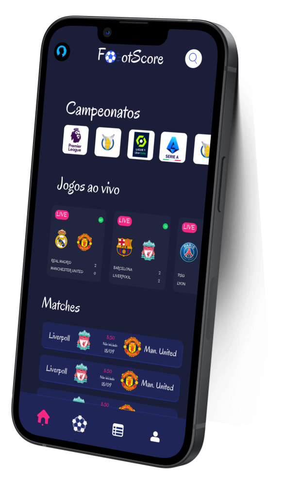

# FootScore APP

Resultados de jogos de futebol em tempo real com FootScore app;

## Screen

#### Login

  

#### Home

  
  

- Desenvolvido em Flutter
- API Graphql

`git clone https://github.com/Rafael-Santos-DV/footscore-flutter.git`

`cd footscore-flutter`
